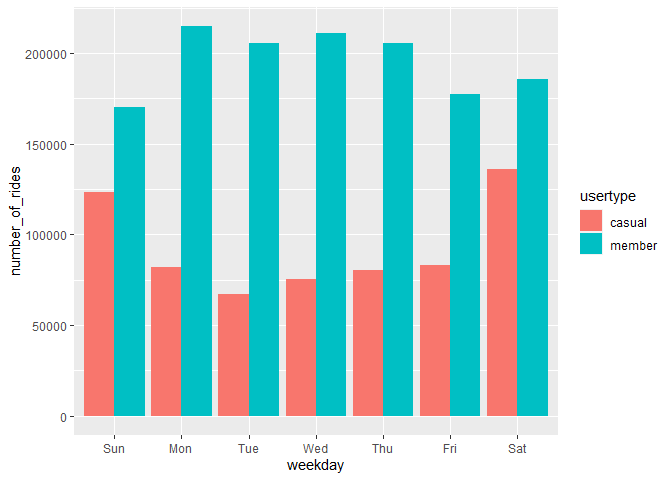
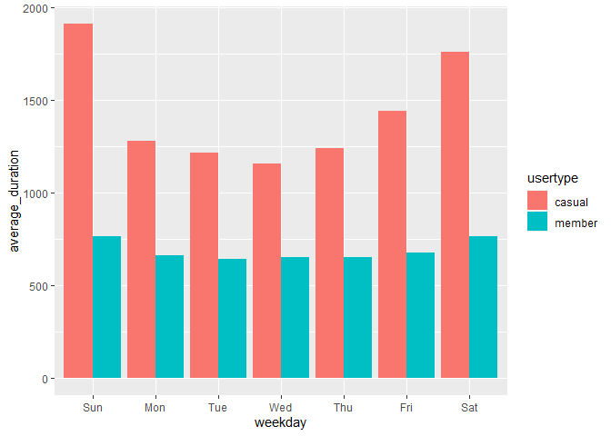

BIKE CASE STUDY
================
2023-05-31

This is the bike case study google capstone project. The goal is to use
data collected over the past 12 months(I used 6) to come up with digital
marketing strategies to help convert casual members to annual members.I
analysed the data to help understand how these two rider groups operate
differently.

\##key question: “In what ways do members and casual riders use Divvy
bikes differently?”

\#STEP 1: LOADING THE DATA

``` r
m9_2022 <- read.csv("202210-divvy-tripdata.csv")
m10_2022 <- read.csv("202210-divvy-tripdata.csv")
m11_2022 <- read.csv("202211-divvy-tripdata.csv")
m12_2022 <- read.csv("202212-divvy-tripdata.csv")
m1_2023 <- read.csv("202301-divvy-tripdata.csv")
m2_2023 <- read.csv("202302-divvy-tripdata.csv")
```

\#STEP 2: WRANGLE DATA AND COMBINE INTO A SINGLE FILE.

\##Compare column names each of the files

``` r
colnames(m9_2022)
```

    ##  [1] "ride_id"            "rideable_type"      "started_at"        
    ##  [4] "ended_at"           "start_station_name" "start_station_id"  
    ##  [7] "end_station_name"   "end_station_id"     "start_lat"         
    ## [10] "start_lng"          "end_lat"            "end_lng"           
    ## [13] "member_casual"

``` r
colnames(m10_2022)
```

    ##  [1] "ride_id"            "rideable_type"      "started_at"        
    ##  [4] "ended_at"           "start_station_name" "start_station_id"  
    ##  [7] "end_station_name"   "end_station_id"     "start_lat"         
    ## [10] "start_lng"          "end_lat"            "end_lng"           
    ## [13] "member_casual"

``` r
colnames(m11_2022)
```

    ##  [1] "ride_id"            "rideable_type"      "started_at"        
    ##  [4] "ended_at"           "start_station_name" "start_station_id"  
    ##  [7] "end_station_name"   "end_station_id"     "start_lat"         
    ## [10] "start_lng"          "end_lat"            "end_lng"           
    ## [13] "member_casual"

``` r
colnames(m12_2022)
```

    ##  [1] "ride_id"            "rideable_type"      "started_at"        
    ##  [4] "ended_at"           "start_station_name" "start_station_id"  
    ##  [7] "end_station_name"   "end_station_id"     "start_lat"         
    ## [10] "start_lng"          "end_lat"            "end_lng"           
    ## [13] "member_casual"

``` r
colnames(m1_2023)
```

    ##  [1] "ride_id"            "rideable_type"      "started_at"        
    ##  [4] "ended_at"           "start_station_name" "start_station_id"  
    ##  [7] "end_station_name"   "end_station_id"     "start_lat"         
    ## [10] "start_lng"          "end_lat"            "end_lng"           
    ## [13] "member_casual"

``` r
colnames(m2_2023)
```

    ##  [1] "ride_id"            "rideable_type"      "started_at"        
    ##  [4] "ended_at"           "start_station_name" "start_station_id"  
    ##  [7] "end_station_name"   "end_station_id"     "start_lat"         
    ## [10] "start_lng"          "end_lat"            "end_lng"           
    ## [13] "member_casual"

\##Rename the columns to make them more consistent

``` r
(q1_2023 <- rename(m1_2023
                    ,trip_id = ride_id
                    ,bikeid = rideable_type
                    ,start_time = started_at 
                    ,end_time = ended_at 
                    ,from_station_name = start_station_name 
                    ,from_station_id = start_station_id
                    ,to_station_name = end_station_name
                    ,to_station_id = end_station_id 
                    ,usertype = member_casual))

(q2_2023 <- rename(m2_2023
                    ,trip_id = ride_id
                    ,bikeid = rideable_type
                    ,start_time = started_at 
                    ,end_time = ended_at 
                    ,from_station_name = start_station_name 
                    ,from_station_id = start_station_id
                    ,to_station_name = end_station_name
                    ,to_station_id = end_station_id 
                    ,usertype = member_casual))

(q9_2022 <- rename(m9_2022
                    ,trip_id = ride_id
                    ,bikeid = rideable_type
                    ,start_time = started_at 
                    ,end_time = ended_at 
                    ,from_station_name = start_station_name 
                    ,from_station_id = start_station_id
                    ,to_station_name = end_station_name
                    ,to_station_id = end_station_id 
                    ,usertype = member_casual))
(q10_2022 <- rename(m10_2022
                    ,trip_id = ride_id
                    ,bikeid = rideable_type
                    ,start_time = started_at 
                    ,end_time = ended_at 
                    ,from_station_name = start_station_name 
                    ,from_station_id = start_station_id
                    ,to_station_name = end_station_name
                    ,to_station_id = end_station_id 
                    ,usertype = member_casual))

(q11_2022 <- rename(m11_2022
                    ,trip_id = ride_id
                    ,bikeid = rideable_type
                    ,start_time = started_at 
                    ,end_time = ended_at 
                    ,from_station_name = start_station_name 
                    ,from_station_id = start_station_id
                    ,to_station_name = end_station_name
                    ,to_station_id = end_station_id 
                    ,usertype = member_casual))
(q12_2022 <- rename(m12_2022
                   ,trip_id = ride_id
                   ,bikeid = rideable_type
                   ,start_time = started_at 
                   ,end_time = ended_at 
                   ,from_station_name = start_station_name 
                   ,from_station_id = start_station_id
                   ,to_station_name = end_station_name
                   ,to_station_id = end_station_id 
                   ,usertype = member_casual))
```

\##Inspect the data frames to look for incongruities

``` r
str(q2_2023)
```

    ## 'data.frame':    190445 obs. of  13 variables:
    ##  $ trip_id          : chr  "CBCD0D7777F0E45F" "F3EC5FCE5FF39DE9" "E54C1F27FA9354FF" "3D561E04F739CC45" ...
    ##  $ bikeid           : chr  "classic_bike" "electric_bike" "classic_bike" "electric_bike" ...
    ##  $ start_time       : chr  "2023-02-14 11:59:42" "2023-02-15 13:53:48" "2023-02-19 11:10:57" "2023-02-26 16:12:05" ...
    ##  $ end_time         : chr  "2023-02-14 12:13:38" "2023-02-15 13:59:08" "2023-02-19 11:35:01" "2023-02-26 16:39:55" ...
    ##  $ from_station_name: chr  "Southport Ave & Clybourn Ave" "Clarendon Ave & Gordon Ter" "Southport Ave & Clybourn Ave" "Southport Ave & Clybourn Ave" ...
    ##  $ from_station_id  : chr  "TA1309000030" "13379" "TA1309000030" "TA1309000030" ...
    ##  $ to_station_name  : chr  "Clark St & Schiller St" "Sheridan Rd & Lawrence Ave" "Aberdeen St & Monroe St" "Franklin St & Adams St (Temp)" ...
    ##  $ to_station_id    : chr  "TA1309000024" "TA1309000041" "13156" "TA1309000008" ...
    ##  $ start_lat        : num  41.9 42 41.9 41.9 41.8 ...
    ##  $ start_lng        : num  -87.7 -87.6 -87.7 -87.7 -87.6 ...
    ##  $ end_lat          : num  41.9 42 41.9 41.9 41.8 ...
    ##  $ end_lng          : num  -87.6 -87.7 -87.7 -87.6 -87.6 ...
    ##  $ usertype         : chr  "casual" "casual" "member" "member" ...

\##Change trip_id and bike_id to character so that they can stack
correctly

``` r
q2_2023 <-  mutate(q2_2023, trip_id = as.character(trip_id)
                    ,bikeid = as.character(bikeid)) 
q1_2023 <-  mutate(q1_2023, trip_id = as.character(trip_id)
                    ,bikeid = as.character(bikeid)) 
q10_2022 <-  mutate(q10_2022, trip_id = as.character(trip_id)
                    ,bikeid = as.character(bikeid)) 
q11_2022 <-  mutate(q11_2022, trip_id = as.character(trip_id)
                    ,bikeid = as.character(bikeid)) 
q12_2022 <-  mutate(q12_2022, trip_id = as.character(trip_id)
                   ,bikeid = as.character(bikeid)) 
q9_2022 <-  mutate(q9_2022, trip_id = as.character(trip_id)
                    ,bikeid = as.character(bikeid)) 
```

\##Stack individual quarter’s data frames into one big data frame

``` r
all_trips <- bind_rows(q2_2023, q1_2023, q10_2022, q11_2022, q12_2022, q9_2022)
```

\##removed the latitude and longitude columns as they were irrelevant to
my analysis

``` r
all_trips <- all_trips %>%  
  select(-c(start_lat, start_lng, end_lat, end_lng))
```

\#STEP 3: CLEAN UP AND ADD DATA TO PREPARE FOR ANALYSIS \##Checked that
the columns were consistent and had the right format

``` r
colnames(all_trips)
```

    ## [1] "trip_id"           "bikeid"            "start_time"       
    ## [4] "end_time"          "from_station_name" "from_station_id"  
    ## [7] "to_station_name"   "to_station_id"     "usertype"

``` r
nrow(all_trips)
```

    ## [1] 2017657

``` r
dim(all_trips)
```

    ## [1] 2017657       9

``` r
head(all_trips)
```

    ##            trip_id        bikeid          start_time            end_time
    ## 1 CBCD0D7777F0E45F  classic_bike 2023-02-14 11:59:42 2023-02-14 12:13:38
    ## 2 F3EC5FCE5FF39DE9 electric_bike 2023-02-15 13:53:48 2023-02-15 13:59:08
    ## 3 E54C1F27FA9354FF  classic_bike 2023-02-19 11:10:57 2023-02-19 11:35:01
    ## 4 3D561E04F739CC45 electric_bike 2023-02-26 16:12:05 2023-02-26 16:39:55
    ## 5 0CB4B4D53B2DBE05 electric_bike 2023-02-20 11:55:23 2023-02-20 12:05:48
    ## 6 C67EB62172C472EB  classic_bike 2023-02-24 18:50:16 2023-02-24 18:56:40
    ##              from_station_name from_station_id               to_station_name
    ## 1 Southport Ave & Clybourn Ave    TA1309000030        Clark St & Schiller St
    ## 2   Clarendon Ave & Gordon Ter           13379    Sheridan Rd & Lawrence Ave
    ## 3 Southport Ave & Clybourn Ave    TA1309000030       Aberdeen St & Monroe St
    ## 4 Southport Ave & Clybourn Ave    TA1309000030 Franklin St & Adams St (Temp)
    ## 5  Prairie Ave & Garfield Blvd    TA1307000160   Cottage Grove Ave & 63rd St
    ## 6        Wells St & Concord Ln    TA1308000050    Clybourn Ave & Division St
    ##   to_station_id usertype
    ## 1  TA1309000024   casual
    ## 2  TA1309000041   casual
    ## 3         13156   member
    ## 4  TA1309000008   member
    ## 5  KA1503000054   member
    ## 6  TA1307000115   member

``` r
tail(all_trips)
```

    ##                  trip_id       bikeid          start_time            end_time
    ## 2017652 DA551F0A9C0DBCA2 classic_bike 2022-10-24 17:45:38 2022-10-24 17:48:02
    ## 2017653 BC3BFA659C9AB6F1 classic_bike 2022-10-30 01:41:29 2022-10-30 01:57:16
    ## 2017654 ACD65450291CF95F classic_bike 2022-10-30 01:41:54 2022-10-30 01:57:09
    ## 2017655 4AAC03D1438E97CA classic_bike 2022-10-15 09:34:11 2022-10-15 10:03:21
    ## 2017656 8E6F3F29785E5D40 classic_bike 2022-10-09 10:21:34 2022-10-09 10:43:45
    ## 2017657 8D14CBE672431920  docked_bike 2022-10-22 13:17:13 2022-10-22 13:46:14
    ##                  from_station_name from_station_id          to_station_name
    ## 2017652    Sedgwick St & North Ave    TA1307000038 Lincoln Ave & Roscoe St*
    ## 2017653 Clifton Ave & Armitage Ave    TA1307000163 Lincoln Ave & Roscoe St*
    ## 2017654 Clifton Ave & Armitage Ave    TA1307000163 Lincoln Ave & Roscoe St*
    ## 2017655    Sedgwick St & North Ave    TA1307000038   Wabash Ave & Grand Ave
    ## 2017656    Sedgwick St & North Ave    TA1307000038 Damen Ave & Clybourn Ave
    ## 2017657    Clark St & Armitage Ave           13146   Wabash Ave & Grand Ave
    ##         to_station_id usertype
    ## 2017652  chargingstx5   member
    ## 2017653  chargingstx5   casual
    ## 2017654  chargingstx5   casual
    ## 2017655  TA1307000117   casual
    ## 2017656         13271   member
    ## 2017657  TA1307000117   casual

``` r
str(all_trips)
```

    ## 'data.frame':    2017657 obs. of  9 variables:
    ##  $ trip_id          : chr  "CBCD0D7777F0E45F" "F3EC5FCE5FF39DE9" "E54C1F27FA9354FF" "3D561E04F739CC45" ...
    ##  $ bikeid           : chr  "classic_bike" "electric_bike" "classic_bike" "electric_bike" ...
    ##  $ start_time       : chr  "2023-02-14 11:59:42" "2023-02-15 13:53:48" "2023-02-19 11:10:57" "2023-02-26 16:12:05" ...
    ##  $ end_time         : chr  "2023-02-14 12:13:38" "2023-02-15 13:59:08" "2023-02-19 11:35:01" "2023-02-26 16:39:55" ...
    ##  $ from_station_name: chr  "Southport Ave & Clybourn Ave" "Clarendon Ave & Gordon Ter" "Southport Ave & Clybourn Ave" "Southport Ave & Clybourn Ave" ...
    ##  $ from_station_id  : chr  "TA1309000030" "13379" "TA1309000030" "TA1309000030" ...
    ##  $ to_station_name  : chr  "Clark St & Schiller St" "Sheridan Rd & Lawrence Ave" "Aberdeen St & Monroe St" "Franklin St & Adams St (Temp)" ...
    ##  $ to_station_id    : chr  "TA1309000024" "TA1309000041" "13156" "TA1309000008" ...
    ##  $ usertype         : chr  "casual" "casual" "member" "member" ...

``` r
summary(all_trips)
```

    ##    trip_id             bikeid           start_time          end_time        
    ##  Length:2017657     Length:2017657     Length:2017657     Length:2017657    
    ##  Class :character   Class :character   Class :character   Class :character  
    ##  Mode  :character   Mode  :character   Mode  :character   Mode  :character  
    ##  from_station_name  from_station_id    to_station_name    to_station_id     
    ##  Length:2017657     Length:2017657     Length:2017657     Length:2017657    
    ##  Class :character   Class :character   Class :character   Class :character  
    ##  Mode  :character   Mode  :character   Mode  :character   Mode  :character  
    ##    usertype        
    ##  Length:2017657    
    ##  Class :character  
    ##  Mode  :character

\##Check for nulls and the number of entries in the usertype column

``` r
table(all_trips$usertype)
```

    ## 
    ##  casual  member 
    ##  646668 1370989

\##Add columns that list the date, month, day, and year of each ride- to
aggregate ride data for each month, day, or year

``` r
all_trips$date <- as.Date(all_trips$start_time) 
all_trips$month <- format(as.Date(all_trips$date), "%m")
all_trips$day <- format(as.Date(all_trips$date), "%d")
all_trips$year <- format(as.Date(all_trips$date), "%Y")
all_trips$day_of_week <- format(as.Date(all_trips$date), "%A")
```

\##Calculate the time difference in a new column as “ride_length”(in
seconds)

``` r
all_trips$ride_length <- difftime(all_trips$end_time,all_trips$start_time)
```

\##Convert the ride_length to numeric run calculations on the data

``` r
all_trips$ride_length <- as.numeric(as.character(all_trips$ride_length))
all_trips$ride_length <- as.numeric(as.character(all_trips$ride_length))
is.numeric(all_trips$ride_length)
```

    ## [1] TRUE

\##Eliminate nulls, negative values and service time

``` r
all_trips_v2 <- all_trips[complete.cases(all_trips$ride_length), ]
all_trips_v2 <- all_trips[!(all_trips$ride_length<0),]

all_trips_v2 <- all_trips[!(all_trips$from_station_name == "HQ QR" | all_trips$ride_length<0),]

all_trips_v2 <- all_trips[complete.cases(all_trips$ride_length), ]
```

\#STEP 4: DESCRIPTIVE ANALYSIS \##Calculate the mean, medium, maximum
and minimum ride length

``` r
mean(all_trips_v2$ride_length)
```

    ## [1] 942.1086

``` r
median(all_trips_v2$ride_length)
```

    ## [1] 499

``` r
max(all_trips_v2$ride_length)
```

    ## [1] 2483235

``` r
min(all_trips_v2$ride_length)
```

    ## [1] -10122

``` r
summary(all_trips_v2$ride_length)
```

    ##      Min.   1st Qu.    Median      Mean   3rd Qu.      Max. 
    ##  -10122.0     292.0     499.0     942.1     873.0 2483235.0

\##Compare members and casual users

``` r
aggregate(all_trips_v2$ride_length ~ all_trips_v2$usertype, FUN = mean)
```

    ##   all_trips_v2$usertype all_trips_v2$ride_length
    ## 1                casual                1492.8385
    ## 2                member                 682.3403

``` r
aggregate(all_trips_v2$ride_length ~ all_trips_v2$usertype, FUN = median)
```

    ##   all_trips_v2$usertype all_trips_v2$ride_length
    ## 1                casual                      597
    ## 2                member                      461

``` r
aggregate(all_trips_v2$ride_length ~ all_trips_v2$usertype, FUN = max)
```

    ##   all_trips_v2$usertype all_trips_v2$ride_length
    ## 1                casual                  2483235
    ## 2                member                    89997

``` r
aggregate(all_trips_v2$ride_length ~ all_trips_v2$usertype, FUN = min)
```

    ##   all_trips_v2$usertype all_trips_v2$ride_length
    ## 1                casual                    -3479
    ## 2                member                   -10122

\##See the average ride length for casual and member rides by weekdays.

``` r
aggregate(all_trips_v2$ride_length ~ all_trips_v2$usertype + all_trips_v2$day_of_week, FUN = mean)
```

    ##    all_trips_v2$usertype all_trips_v2$day_of_week all_trips_v2$ride_length
    ## 1                 casual                   Friday                1438.2142
    ## 2                 member                   Friday                 676.2128
    ## 3                 casual                   Monday                1275.6096
    ## 4                 member                   Monday                 660.1529
    ## 5                 casual                 Saturday                1755.9277
    ## 6                 member                 Saturday                 760.8171
    ## 7                 casual                   Sunday                1908.1635
    ## 8                 member                   Sunday                 763.1438
    ## 9                 casual                 Thursday                1237.2875
    ## 10                member                 Thursday                 648.1010
    ## 11                casual                  Tuesday                1212.7844
    ## 12                member                  Tuesday                 640.8227
    ## 13                casual                Wednesday                1153.8712
    ## 14                member                Wednesday                 649.6162

``` r
all_trips_v2$day_of_week <- ordered(all_trips_v2$day_of_week, levels=c("Sunday", "Monday", "Tuesday", "Wednesday", "Thursday", "Friday", "Saturday"))
```

\##Analyze ridership data by type and weekday

``` r
all_trips_v2 %>% 
  mutate(weekday = wday(start_time, label = TRUE)) %>%  #creates weekday field using wday()
  group_by(usertype, weekday) %>%  #groups by usertype and weekday
  summarise(number_of_rides = n()                           #calculates the number of rides and average duration 
            ,average_duration = mean(ride_length)) %>%      # calculates the average duration
  arrange(usertype, weekday)                                # sorts
```

    ## `summarise()` has grouped output by 'usertype'. You can override using the
    ## `.groups` argument.

    ## # A tibble: 14 × 4
    ## # Groups:   usertype [2]
    ##    usertype weekday number_of_rides average_duration
    ##    <chr>    <ord>             <int>            <dbl>
    ##  1 casual   Sun              123534            1908.
    ##  2 casual   Mon               82190            1276.
    ##  3 casual   Tue               66870            1213.
    ##  4 casual   Wed               75198            1154.
    ##  5 casual   Thu               80062            1237.
    ##  6 casual   Fri               82916            1438.
    ##  7 casual   Sat              135898            1756.
    ##  8 member   Sun              170382             763.
    ##  9 member   Mon              214812             660.
    ## 10 member   Tue              205726             641.
    ## 11 member   Wed              211354             650.
    ## 12 member   Thu              205483             648.
    ## 13 member   Fri              177454             676.
    ## 14 member   Sat              185778             761.

\##Visualize the number of rides by rider type

    ## `summarise()` has grouped output by 'usertype'. You can override using the
    ## `.groups` argument.

<!-- -->

\##Create a visualization for average duration

    ## `summarise()` has grouped output by 'usertype'. You can override using the
    ## `.groups` argument.

<!-- -->

\#STEP 5: EXPORT SUMMARY FILE FOR FURTHER ANALYSIS

rmarkdown::render(“cyclistic.Rmd”, output_format = “html_document”)
